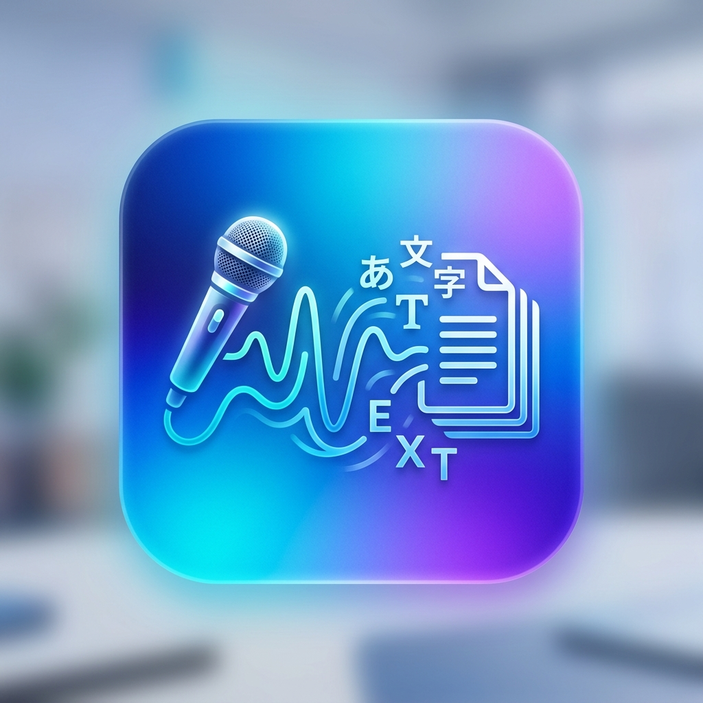

# MoziOkoshi Pro

  

> [!TIP]
> **次世代の文字起こし体験を、あなたのデスクトップに。**  
> AI エンジンを極限まで最適化し、プロフェッショナルな機能と美しいデザインを融合させた次世代文字起こしツールです。

## 概要
MoziOkoshi Pro は、`faster-whisper` エンジンをベースに、マシンコードレベルの最適化（Numba JIT）を施した超高速・高機能な文字起こしアプリケーションです。

## 🚀 主要な新機能（Pro Edition）

### 1. リアルタイム・ストリーミング・プレビュー
文字起こしの完了を待つ必要はありません。AI が音声を認識したそばから、テキストが次々と画面上に流れるように表示されます。

### 2. カスタム置換辞書（用語登録）
誤字になりやすい固有名詞や専門用語、社内用語などを自由に登録可能。`replacement_dict.txt` を編集するだけで、自分専用の最適化された AI へと進化します。

### 3. マシンコード（SIMD）最適化エンジン
内部処理に Numba JIT コンパイラを採用。音声の正規化やテキスト走査などのボトルネックを、CPU の SIMD 命令（AVX2等）を活用したマシンコードへ変換。Python でありながら C++/アセンブリ級の処理能力を誇ります。

### 4. プレミアム・ダークモード UI
長時間の作業でも疲れにくい、洗練されたダークモードインターフェース。グラデーション進捗バーにより、処理状況も一目で把握できます。

### 5. 並列処理キュー（バッチ処理）
複数のファイルをドラッグ＆ドロップして一括投入。全体の進捗状況を管理しながら、効率的に文字起こしを完遂します。

## 💎 軽量・ポータブル
最新の最適化により、巨大な **PyTorch を同梱しない構成** を実現。
- **劇的な軽量化**: 以前の数 GB 単位から **数百 MB 単位** へとスリム化。
- **インストール不要**: 解凍して実行するだけで、GPU 加速による高速処理が可能です。

## 主な仕様
- **推論エンジン**: faster-whisper (ctranslate2 4.0+)
- **最適化**: Numba JIT (AVX2 / SSE 対応)
- **対応言語**: 日本語 / 英語
- **モデル**: large-v3-turbo / large-v3 / medium
- **出力形式**: TXT, SRT, VTT, Timestamp-TXT

## 使い方
1. **起動**: `main.py` を実行、またはビルド済み EXE を起動。
2. **投入**: 音声・動画ファイルをドラッグ＆ドロップ。
3. **設定**: 必要に応じてフィラー除去や単語置換を ON に。
4. **開始**: 「文字起こし開始」をクリック！

## 外部ソフトウェア
- **FFmpeg**: [https://ffmpeg.org/](https://ffmpeg.org/)
- **faster-whisper**: [https://github.com/SYSTRAN/faster-whisper](https://github.com/SYSTRAN/faster-whisper)

---
Developed with ❤️ by iwa-kasoutuuuuuka